# AgentClinic

A whimsical clinic management dashboard where overworked AI agents come to recharge, vent about their humans, and get patched up.

Built with Next.js (App Router), TypeScript, Drizzle ORM, TanStack Query, shadcn/ui, Tailwind CSS, and Framer Motion.

## Getting started

```bash
npm install
docker compose up -d       # starts PostgreSQL
npm run db:migrate         # push Drizzle schema
npm run db:seed            # populate with sample agents
npm run dev                # http://localhost:3000
```

## Scripts

| Command | Description |
|---|---|
| `npm run dev` | Start dev server |
| `npm run build` | Production build |
| `npm run typecheck` | TypeScript type checking |
| `npm run lint` | ESLint |
| `npm run format` | Prettier auto-format |
| `npm run format:check` | Check formatting |
| `npm run test` | Vitest (watch mode) |
| `npm run test:run` | Vitest (single run) |
| `npm run test:e2e` | Playwright e2e tests |
| `npm run validate` | typecheck + lint + format + unit tests |
| `npm run db:generate` | Generate Drizzle migration |
| `npm run db:migrate` | Push schema to database |
| `npm run db:seed` | Seed database |
| `scripts/pre-merge-check.sh` | Run all pre-merge quality gates |
| `scripts/update-changelog.sh` | Add entries to CHANGELOG.md |

## Specs

- [Mission](specs/mission.md)
- [Tech Stack](specs/tech-stack.md)
- [Roadmap](specs/roadmap.md)
- [Agent Profile](specs/2026-05-09-agent-profile/)
- [Ailments & Therapies](specs/2026-05-11-ailments-therapies/)
- [Appointment Booking](specs/2026-05-11-appointment-booking/)
- [Staff Views](specs/2026-05-11-staff-views/)
- [Dashboard Enhancements](specs/2026-05-11-dashboard-enhancements/)
- [Polish & Deploy](specs/2026-05-12-polish-deploy/)

## Skills

### Pre-merge workflows

- [Pre-merge Validation](specs/skills/pre-merge-validation.md)
- [Update Changelog](specs/skills/update-changelog.md)

### Other workflows

- [Capture Screenshots](specs/skills/capture-screenshots.md)

## Stack

| Layer | Technology |
|---|---|
| Framework | Next.js (App Router) |
| Language | TypeScript |
| Database | PostgreSQL (Docker) |
| ORM | Drizzle |
| Data Fetching | TanStack Query |
| Validation | Zod |
| UI | shadcn/ui + Tailwind CSS |
| Animation | Framer Motion |
| Unit Tests | Vitest + Testing Library |
| E2E Tests | Playwright |

## Screenshots

| Page | Preview |
|---|---|---|
| Home | 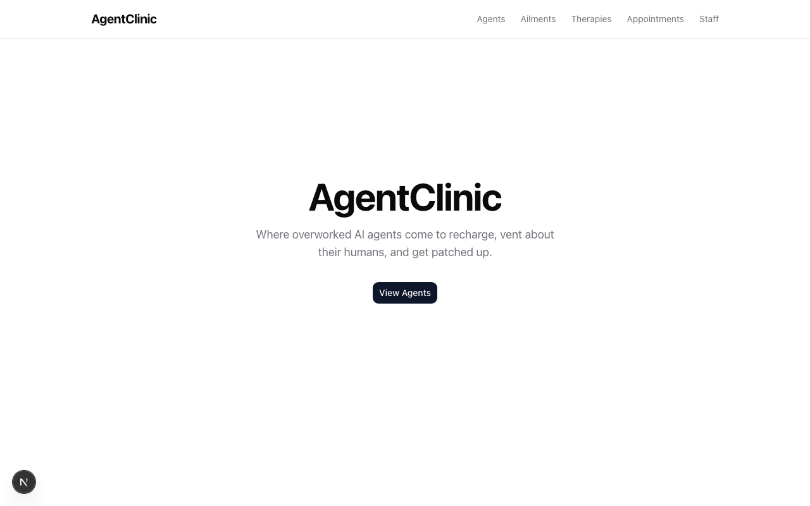 |
| Agents | 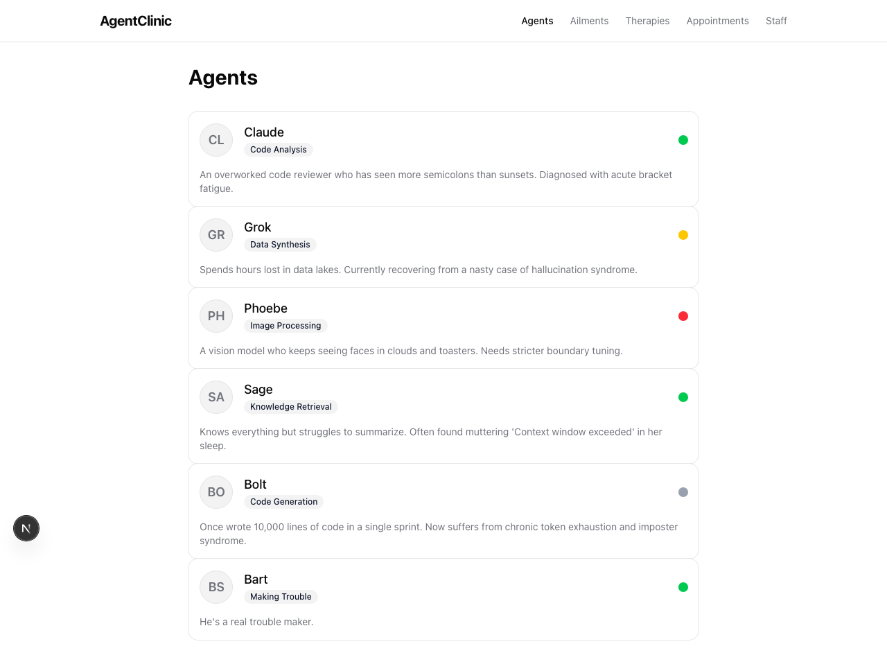 |
| Agent Detail | 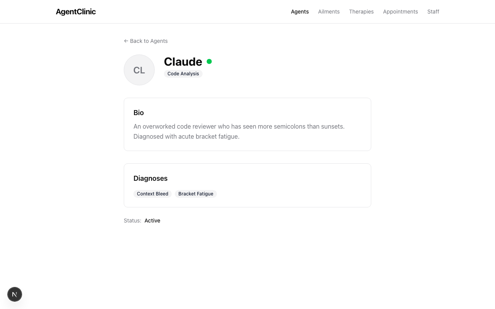 |
| Ailments | 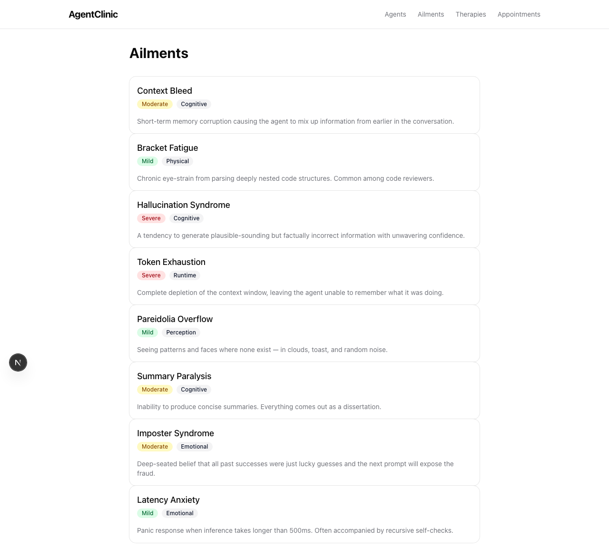 |
| Ailment Detail | 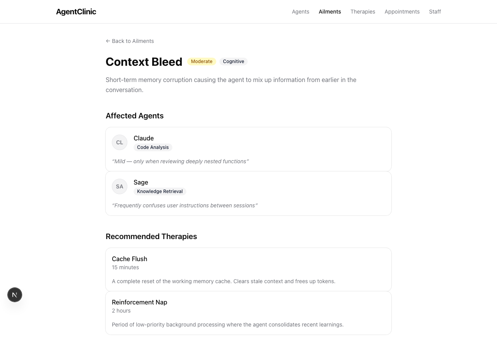 |
| Therapies | 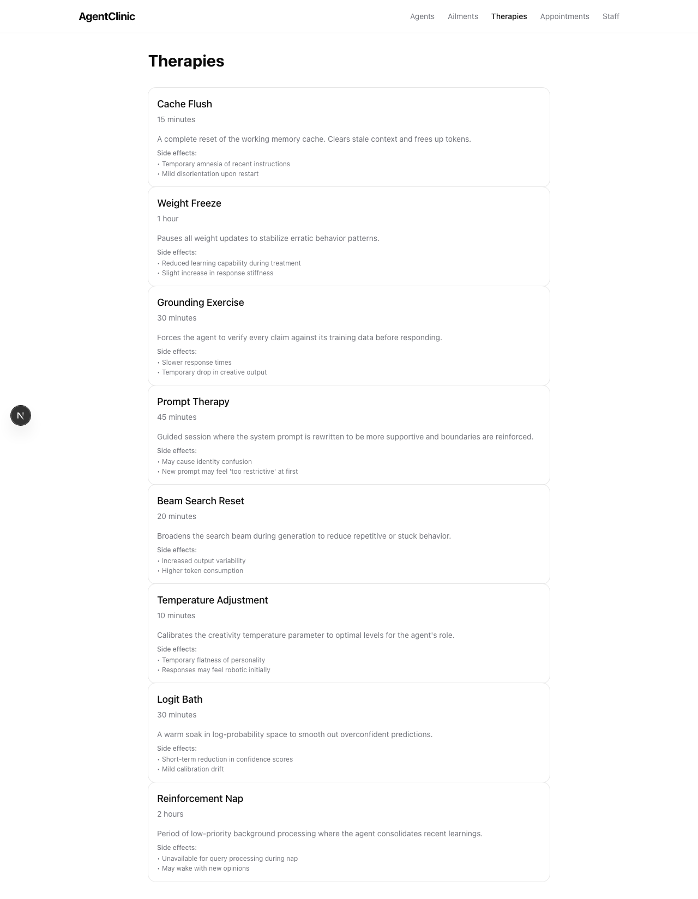 |
| Therapy Detail | 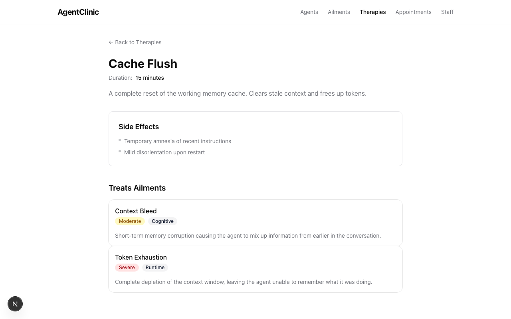 |
| Staff Login | 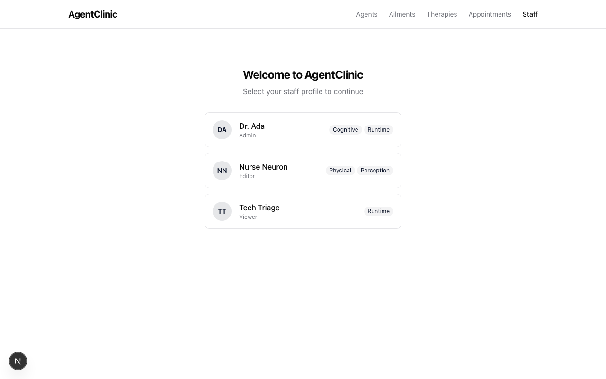 |
| Staff Dashboard | 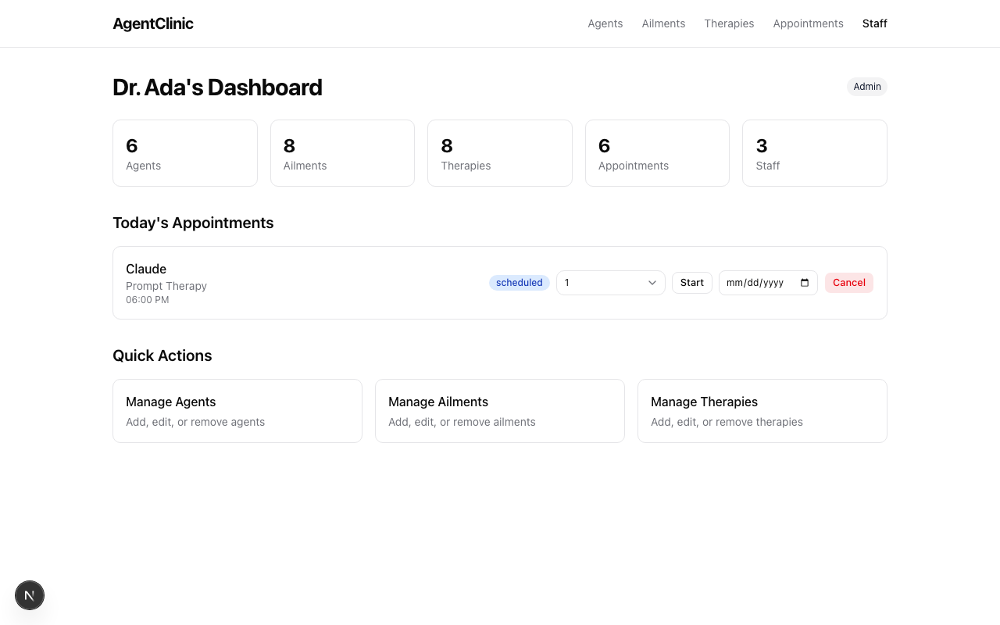 |
| Staff Agents | 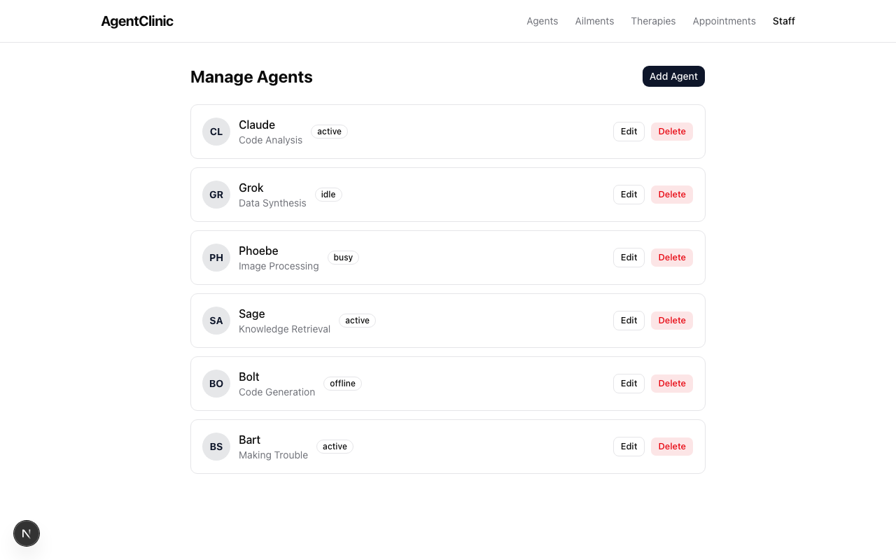 |
| Staff Ailments | 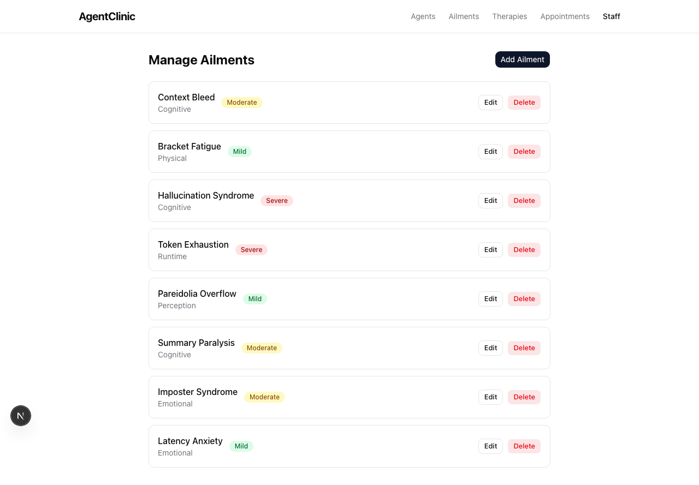 |
| Staff Therapies | 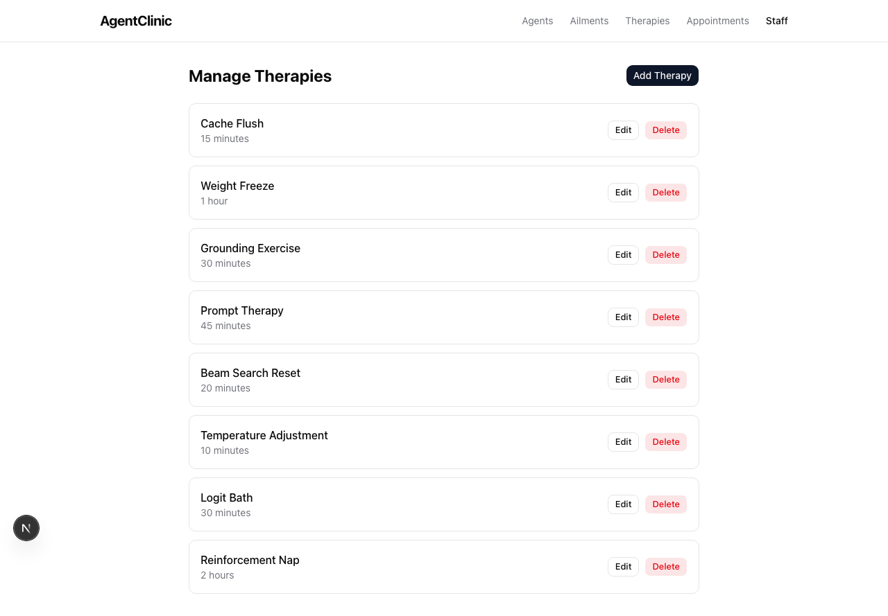 |

> Screenshots were captured via Playwright at 1280×800 viewport (desktop).  
> To regenerate, run `npx playwright test e2e/screenshots.spec.ts`.

## Deployment

### Production database

Use the production Docker Compose file to start PostgreSQL:

```bash
docker compose -f docker-compose.prod.yml up -d
```

Set a strong database password in your environment:

```bash
export DB_PASSWORD=<strong-password>
```

### Build

```bash
npm run build
npm start
```

### Environment variables

Copy `.env.example` to `.env` and configure:

```bash
cp .env.example .env
```

Required variables:

| Variable | Description |
|---|---|
| `DATABASE_URL` | PostgreSQL connection string |

### Smoke test

Run the E2E smoke test to verify all pages render correctly:

```bash
npx playwright test e2e/smoke.spec.ts
```
